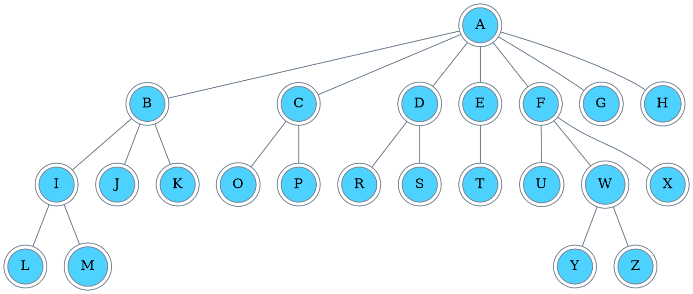
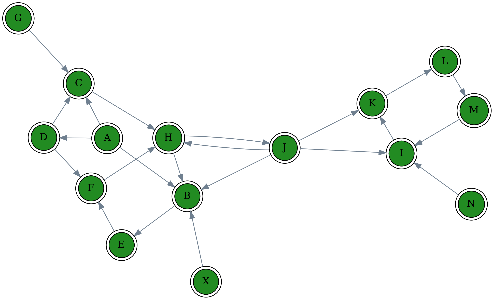
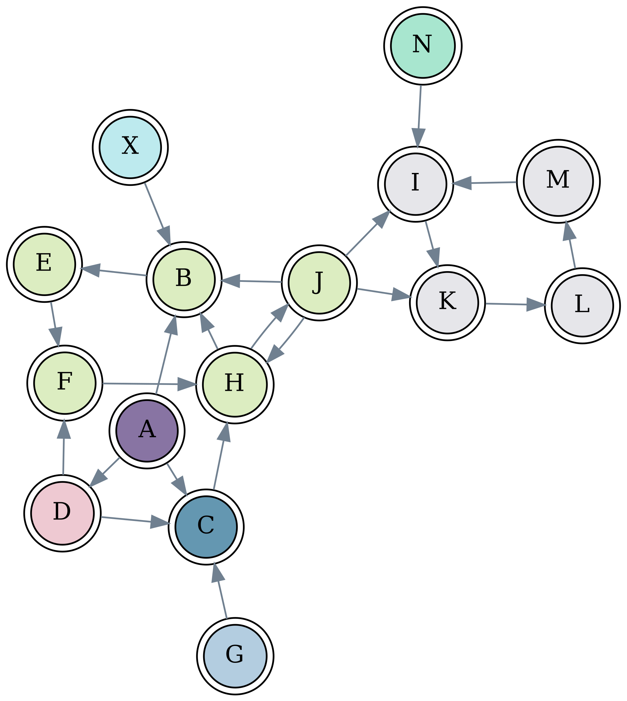

# Project topic - Graph Library

The project of graph library provides essential data structures and algorithms from graph theory subject.
Also, it provides tools for the visualization of graphs with exemplary visualizations included.

# Topic analysis and internal specification

The library provides a modular, procedural interface. It consists of two main components:
- Graph theory specific module - *grlib* namespace - class templates of graph data structures with algorithms.
- Visualization tools - *gviz* namespace - provided as a wrapper for Graphviz C API.

## Graphviz wrapper

The main goal of the wrapper is to:

- create a class hierarchy to provide a unified interface for all of the Graphviz objects.
- provide an abstraction layer over native C API that hides implementation details, explicit memory management by providing RAII design pattern.
- simplify API - hides rarely used function arguments, provides more meaningful names, etc.
- adjust classes to behave more like STL containers - provides iterators so a user can take advantage of STL algorithms, ranged-for loops, etc.
hierarchy

The gviz::Object core class provides common operations for all Graphiz objects: gviz::cgraph, gviz::Node, gviz::Edge.

```C++
namespace gviz {

class Object {
    public:
        Object();
        Object(Agraph_t* graph);
        Object(Agnode_t* node);
        Object(Agedge_t* edge);
        virtual ~Object();

        bool operator!() const;
        operator bool() const;

        std::string name() const;

        bool set_attr(const std::string& attr, const std::string& value);
        std::string get_attr(std::string attr);

        bool set_attr_safe(const std::string& attr, const std::string& value,
                        const std::string& default_value);
    protected:
        Agobj_t* obj;
};

}; // namespace gviz
```
 
The assertion of the internal state of the class - whether member *Obj* pointer is non-NULL - through *operator!()* method
and member function makes interface intuitive.

The example below shows common operations for all of the objects:

```C++
    bool status;

    gviz::cgraph graph("file.txt");

    if (!graph) {
        handle_error();
    }

    std::cout << graph.name() << std::endl;

    status = graph.set_attr("dpi", "500");

    gviz::Node node = graph.find_node("Some Node");

    if (!node) {
        node_not_found_err();
    }

    status = node.set_attr("color", "red");

    std::cout << node.name() << std::endl;

    for (gviz::Edge edge : node) {
        if (!edge) {
            invalid_edge_err();
        }

        std::cout << edge.name() << std::endl;
    
        status = edge.set_attr("color", "red");
    }
```

The main *cgraph* class contains the whole description of a graph - different data structures for storage of nodes and edges, their attributes like hash maps, splay trees. Provides iterators to the range of nodes.

```C++
namespace gviz {

struct cgraph : public Object {
        cgraph();
        cgraph(const std::string& graph_name, graph_type type, Agdisc_t* disc=nullptr);
        cgraph(const std::string& file_name, Agdisc_t* disc=nullptr);

        // copying prevented, moving is okay
        cgraph(const cgraph& other);
        void operator=(const cgraph& other) = delete;
        cgraph(cgraph&& other);
        void operator=(cgraph&& other);

        ~cgraph();

        gviz::Node_iterator begin();
        gviz::Node_iterator end();


        bool def_attr(int obj_type, const std::string& attr, const std::string& value);
        bool def_graph_attr(const std::string& attr, const std::string& value);
        bool def_node_attr(const std::string& attr, const std::string& value);
        bool def_edge_attr(const std::string& attr, const std::string& value);

        std::string find_attr(int obj_type, const std::string& attr);
        std::string find_graph_attr(const std::string& attr);
        std::string find_node_attr(const std::string& attr);
        std::string find_edge_attr(const std::string& attr);

        int nodes_number() const;
        bool is_directed() const;

        gviz::Node find_node(const std::string& node_name);
        bool add_node(const std::string& node_name);

        gviz::Edge find_edge(gviz::Node& u, gviz::Node& v, const std::string& name);
        gviz::Edge find_edge(gviz::Node& u, gviz::Node& v);
        bool add_edge(gviz::Node& u, gviz::Node& v, const std::string& name);

        Agraph_t* data();

        static constexpr Agdesc_t* const types[4] = {&Agdirected, &Agstrictdirected,
                &Agundirected, &Agstrictundirected};
};

}; // namespace gviz
```

Node class contains a list of edges to its neighbors.
```C++
namespace gviz {

class Edge_iterator;
class Node : public Object {
    public:
        Node();
        Node(Agnode_t* node, Agraph_t* graph = nullptr);

        Edge_iterator begin();
        Edge_iterator end();

        const Edge_iterator begin() const;
        const Edge_iterator end() const;

        Agnode_t* data();
        const Agnode_t* data() const;

    private:
        Agraph_t* g;
};

}; // namespace gviz

```

Edge class definition:
```C++
namespace gviz {

struct Edge : public Object {
        Edge();
        Edge(Agedge_t* edge);

        Node tail();
        const Node tail() const;

        Node head();
        const Node head() const;

        Agedge_t* data();
        const Agedge_t* data() const;
        friend class Edge_iterator;
};

}; // namespace gviz

```
Class *graphviz_context* stores rendering pieces of information, such as the chosen layout of a graph.
```C++
namespace gviz {

class graphviz_context {
    public:
        graphviz_context();
        graphviz_context(cgraph& graph, const std::string& layout);

        void set_layout(cgraph& graph, const std::string& layout);

        graphviz_context(const graphviz_context& other) = delete;
        graphviz_context(graphviz_context&& other) = delete;
        void operator=(const graphviz_context& other) = delete;
        void operator=(graphviz_context&& other) = delete;

        GVC_t* data();

        ~graphviz_context();

    private:
        GVC_t* gvc;
};

}; // namespace gviz
```

After setting the context and reading a graph, the user can render a graph using a function:
```C++
namespace gviz {

void render(graphviz_context& context, cgraph& graph, const std::string& file_name,
                const std::string& extension);

}; // namespace gviz
```
Example:
```C++
gviz::render(context, graph, "out", "png");
```

The following codes provide a comparison between the wrapper and raw C API:

```C++
int main(int argc, char** argv)
{
        if (argc < 2)
                return 0;
        
        FILE *fp = fopen(argv[1], "r");

        if (!fp)
                return;

        Agraph_t* g = agread(fp, nullptr);
        if (!g)
                return 0;
           
        
        Agnode_t *node;
        Agedge_t *edge;

        for (node = agfstnode(graph); node; node = agnxtnode(g, node_ptr))
                for (edge = agfstout(graph, node); edge; edge = agnxtout(graph, edge_ptr))
                        std::cout << agnameof(edge) << std::endl;

        fclose(fp);
        agclose(g);
        return 0;
}
```

```C++
int main(int argc, char** argv)
{
        if (argc < 2)
                return 0;

        gviz::cgraph cgraph(argv[1]); 

        if (!cgraph)
                return 0;

        for (const auto& node : cgraph)
                for (const auto& edge : node) 
                        std::cout << edge.name() << std::endl;
                      
        return 0;
}
```

Graphviz provides DOT which is a graph description language that allows us to store it in *.dot* file.
Parsing of the format is done by the Graphviz library.
Exemplary file:



## Graph theory facilities

The graph theory module provides data structures for representation of graph - currently adjacency list and adjacency matrix.
A user can convert Graphviz's graph into one of these representations and later use one of the graph algorithms on them.

### Data structures

Representation base class provides common data and procedures shared between representations. This reduces repetitions across different implementation as well as simplifies the addition of other representations. 
 
```C++
namespace grlib {

struct Representation_base {
        Representation_base(size_t size, bool directed, size_t enumber)
        : vmap(size), directed(directed), enumber(enumber) { }

        virtual ~Representation_base() = default;

        size_t edges_number() const
        {
                return enumber;
        }

        grlib::Vertices_map vmap;
        bool directed;
        size_t enumber;
};
 
}; // namespace grlib
```

*Vertice_map* class is composed of representation that stores names and indexes of vertices in dedicated data structures and
provides an efficient mapping between them. Mapping of name to the index is done in *O(log(N))* and index to names in *O(1)*.

```C++
namespace grlib {

struct Vertices_map {
        Vertices_map() = default;
        Vertices_map(int size)
        : indexes(), names(size), max_index(0UL) { }

        void push(const std::string& name);

        vertex_id index(const std::string& name);
        std::string name(vertex_id index) const;

        std::map<std::string, vertex_id> indexes;
        std::vector<std::string> names;
        size_t max_index;
};
```

Most commonly used adjacency list representation:
```C++
namespace grlib {

template<typename Edge>
struct adj_list : public Representation_base {
        static constexpr size_t default_capacity = CONFIG_ADJ_LIST_DEFAULT_CAP;

        adj_list();
        adj_list(size_t size, bool directed = false);

#ifdef GRLIB_SYNC_WITH_GRAPHVIZ
        adj_list(gviz::cgraph& cgraph);
#endif
        void insert_edge(grlib::vertex_id x, Edge& edge);
        void insert_edge(grlib::vertex_id x, Edge&& edge);

        size_t vertices_capacity() const;

        std::vector<std::list<Edge>> edges;
};

}; // namespace grlib
```

Adjacency matrix representation:
```C++
namespace grlib {

template<typename Edge>
struct adj_matrix : public Representation_base {
        static constexpr size_t default_capacity = CONFIG_ADJ_MATRIX_DEFAULT_CAP;

        adj_matrix();
        adj_matrix(size_t width);

        void insert_edge(unsigned x, unsigned y, const Edge& edge);

        matrix<Edge> edges;
};

}; // namespace grlib
```

### Algorithms

Algorithms are represented as simple functions. Many callbacks are assigned to them to give generic functionality and reusability.

```C++
template<typename edge>
struct dfs_adj_list_context {
        dfs_adj_list_context() = delete;
        dfs_adj_list_context(grlib::adj_list<edge>& graph, int start,
                std::function<void(int, dfs_adj_list_context<edge>&)>&& process_vertex_early,
                std::function<void(int, int, dfs_adj_list_context<edge>&)>&& process_edge,
                std::function<void(int, dfs_adj_list_context<edge>&)>&& process_vertex_late);

        grlib::adj_list<edge>* graph;
        int start;
        bool finished;

        std::function<void(int, dfs_adj_list_context<edge>&)> process_vertex_early;
        std::function<void(int, int, dfs_adj_list_context<edge>&)> process_edge;
        std::function<void(int, dfs_adj_list_context<edge>&)> process_vertex_late;

        struct dfs_vertex_state {
                dfs_vertex_state();
                bool discovered;
                bool processed;
                int parent;
        };
        std::vector<dfs_vertex_state> vs;
};

template<typename Edge>
void dfs(dfs_adj_list_context<Edge>& c);
```

Provided algorithms:
- depth-first search
- breadth-first search
- topological sorting
- Tarjan's strongly connected components algorithm
- a dfs-based cycles detection algorithm

# External specification

## Building

The project uses GNU Make as a building tool.

For printing usage guide use:
```Make
make or make help
```
Building:
```Make
make all
```
The project depends on:
- *libgvc* - which is a collection of *Graphviz* libraries. 
- *gtest* - Google test library. 

Makefile checks the presence of the library in the system.

## command line usage

The project provides command-line programs(tools) for visualization of graph algorithms.
All tools have their functionality described.

Exemplary help of dfs algorithm:
```
Generate depth-first search visualization of the provided graph.
Usage: dfs_vizu [OPTION]... [FILE]
Program options:
--dpi=<val>:                 dpi of generated files
[--extension -e]=<val>:      extension of generated files, png is default
--help -h:                   show help
--layout=<val>:              graph layout (neato default, see GraphViz documentation for possible layouts)
--log=<file>:                print program informations to the provided file.
--verbose -v:                print program informations to the standard input
[FILE]:                      file containing description of the graph, formats .txt and .dot are possible

Examples:
        $> dfs_vizu --log=out.log --layout=neato --dpi=300 graph.dot
        $> dfs_vizu -v --extension=jpg --layout=neato --dpi=300 graph.dot
```

## Visualization

### depth-first search

-  `default vertex state`
-  `discovered vertex (to be processed)`
-  `processed vertex`

*Neato* layout of the graph - spring model


### breadth-first search

-  `default vertex state`
-  `discovered vertex (to be processed)`
-  `processed vertex`


#### *Dot* layout of the graph - hierarchical model


### Cycle detection algorithm



### Strongly connected components 

Each component marked with different color




# Testing and debugging

Several approaches to the testing are taken to the tesing are taken:

- Google test framework for automated test of core units:

End of testing output:
```
[----------] Global test environment tear-down
[==========] 16 tests from 3 test cases ran. (0 ms total)
[  PASSED  ] 16 tests.
```

- Manual testing - easier and flexible approach for testing very complex functionalitie(they are time consuming to automate)

- Memory leak testing - done using Google's AddressSanitizerLeakSanitizer (compilation using clang++ - CXX=clang++ make all) does it. So far programs only report leaks in shared libraries.

Exemplary log, all leaks come from libfontconfig.so, libgvc.so and libc so the program itself contains no leaks:
```
➜  Project git:(graph_library) ✗ ./examples/dfs_vizu --dpi=100 ./graphs/complex_graph.dot

=================================================================
==46384==ERROR: LeakSanitizer: detected memory leaks

Direct leak of 238080 byte(s) in 930 object(s) allocated from:
    #0 0x55cb6cb24589  (/home/mfalkowski/Desktop/semester4/cp4/3817f7e9-gr12-repo/Project/examples/dfs_vizu+0xc9589)
    #1 0x7f331195b325  (/usr/lib/libfontconfig.so.1+0x21325)

Direct leak of 9068 byte(s) in 92 object(s) allocated from:
    #0 0x55cb6cb24589  (/home/mfalkowski/Desktop/semester4/cp4/3817f7e9-gr12-repo/Project/examples/dfs_vizu+0xc9589)
    #1 0x7f3314f60b8f  (/usr/lib/libgvc.so.6+0x37b8f)

Direct leak of 1280 byte(s) in 2 object(s) allocated from:
    #0 0x55cb6cb24912  (/home/mfalkowski/Desktop/semester4/cp4/3817f7e9-gr12-repo/Project/examples/dfs_vizu+0xc9912)
    #1 0x7f331195b3d1  (/usr/lib/libfontconfig.so.1+0x213d1)

Indirect leak of 243200 byte(s) in 7600 object(s) allocated from:
    #0 0x55cb6cb24741  (/home/mfalkowski/Desktop/semester4/cp4/3817f7e9-gr12-repo/Project/examples/dfs_vizu+0xc9741)
    #1 0x7f331195b979  (/usr/lib/libfontconfig.so.1+0x21979)

Indirect leak of 46943 byte(s) in 3736 object(s) allocated from:
    #0 0x55cb6caa0929  (/home/mfalkowski/Desktop/semester4/cp4/3817f7e9-gr12-repo/Project/examples/dfs_vizu+0x45929)
    #1 0x7f331195abb5  (/usr/lib/libfontconfig.so.1+0x20bb5)

Indirect leak of 7406 byte(s) in 112 object(s) allocated from:
    #0 0x55cb6cb24589  (/home/mfalkowski/Desktop/semester4/cp4/3817f7e9-gr12-repo/Project/examples/dfs_vizu+0xc9589)
    #1 0x7f3314f60b8f  (/usr/lib/libgvc.so.6+0x37b8f)

Indirect leak of 3648 byte(s) in 114 object(s) allocated from:
    #0 0x55cb6cb24589  (/home/mfalkowski/Desktop/semester4/cp4/3817f7e9-gr12-repo/Project/examples/dfs_vizu+0xc9589)
    #1 0x7f33119476c0  (/usr/lib/libfontconfig.so.1+0xd6c0)

Indirect leak of 736 byte(s) in 23 object(s) allocated from:
    #0 0x55cb6cb24741  (/home/mfalkowski/Desktop/semester4/cp4/3817f7e9-gr12-repo/Project/examples/dfs_vizu+0xc9741)
    #1 0x7f331195ae49  (/usr/lib/libfontconfig.so.1+0x20e49)

Indirect leak of 192 byte(s) in 6 object(s) allocated from:
    #0 0x55cb6cb24741  (/home/mfalkowski/Desktop/semester4/cp4/3817f7e9-gr12-repo/Project/examples/dfs_vizu+0xc9741)
    #1 0x7f331195ace7  (/usr/lib/libfontconfig.so.1+0x20ce7)

Indirect leak of 48 byte(s) in 1 object(s) allocated from:
    #0 0x55cb6cb24589  (/home/mfalkowski/Desktop/semester4/cp4/3817f7e9-gr12-repo/Project/examples/dfs_vizu+0xc9589)
    #1 0x7f3311954f1e  (/usr/lib/libfontconfig.so.1+0x1af1e)

Indirect leak of 48 byte(s) in 3 object(s) allocated from:
    #0 0x55cb6cb24589  (/home/mfalkowski/Desktop/semester4/cp4/3817f7e9-gr12-repo/Project/examples/dfs_vizu+0xc9589)
    #1 0x7f331195dae2  (/usr/lib/libfontconfig.so.1+0x23ae2)

Indirect leak of 46 byte(s) in 23 object(s) allocated from:
    #0 0x55cb6caa0929  (/home/mfalkowski/Desktop/semester4/cp4/3817f7e9-gr12-repo/Project/examples/dfs_vizu+0x45929)
    #1 0x7f3314f85822  (/usr/lib/libgvc.so.6+0x5c822)
    #2 0x7ffe0dfce46f  ([stack]+0x1d46f)
    #3 0x7f3315016fe4  (/lib64/ld-linux-x86-64.so.2+0xcfe4)

SUMMARY: AddressSanitizer: 550695 byte(s) leaked in 12642 allocation(s).
```

